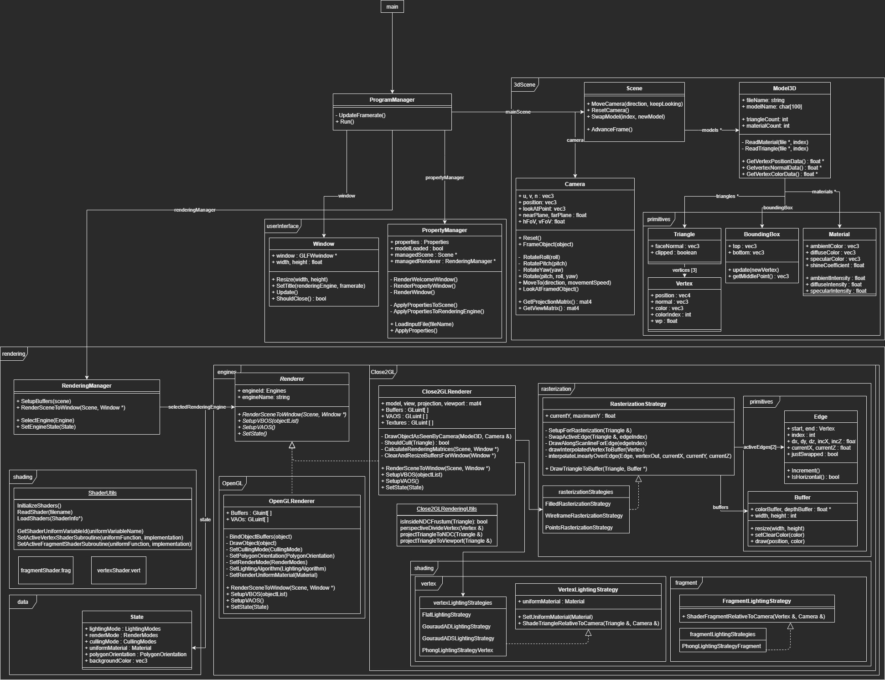

# ClosedGL
3D Application in C++/OpenGL for `INF01009 / CMP143 Computação Gráfica`. 

Allows the user to load 3D Studio Max models and manipulate the camera to inspect the model under different lighting and rendering modes. The user may switch between an `OpenGL` and `Close2GL` implementation, the latter performing rasterization and shading in sowtare, rendering the results to the window via a texture.

## Application Structure
The below pseudo-UML diagram displays how the code is structured.

